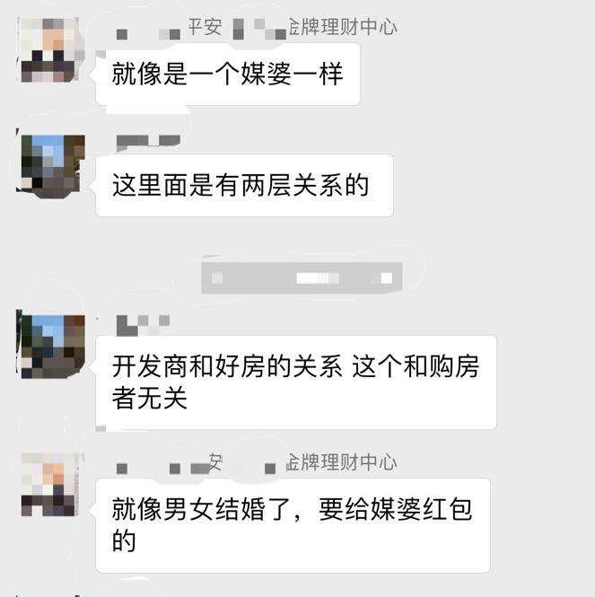
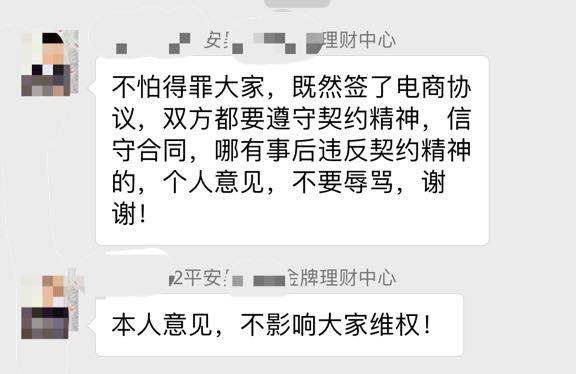
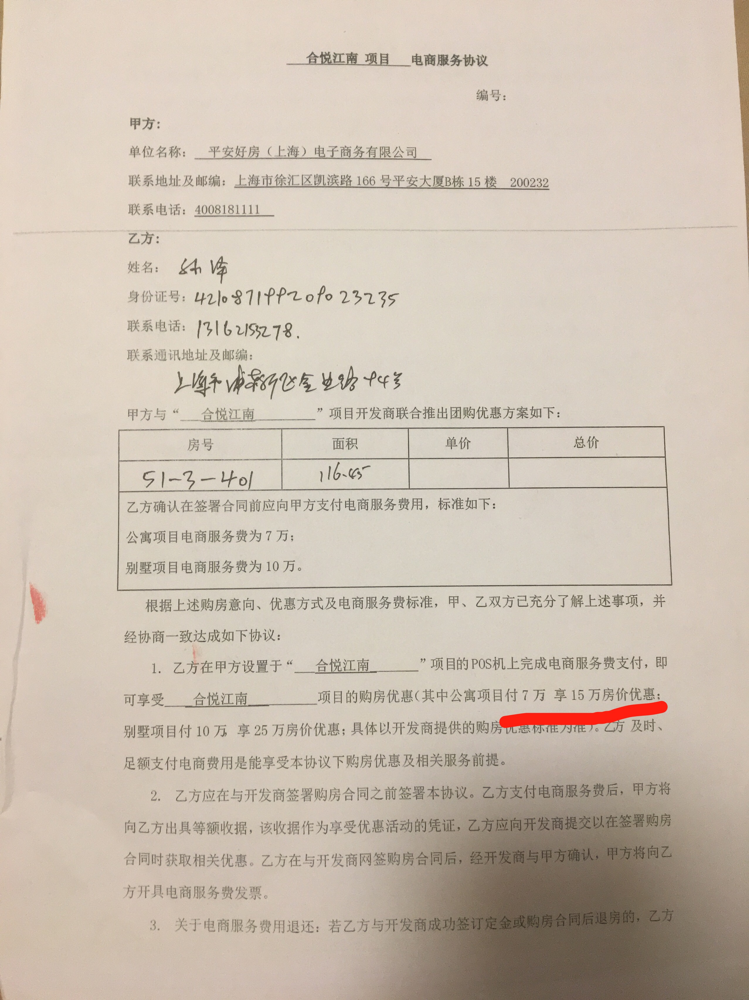
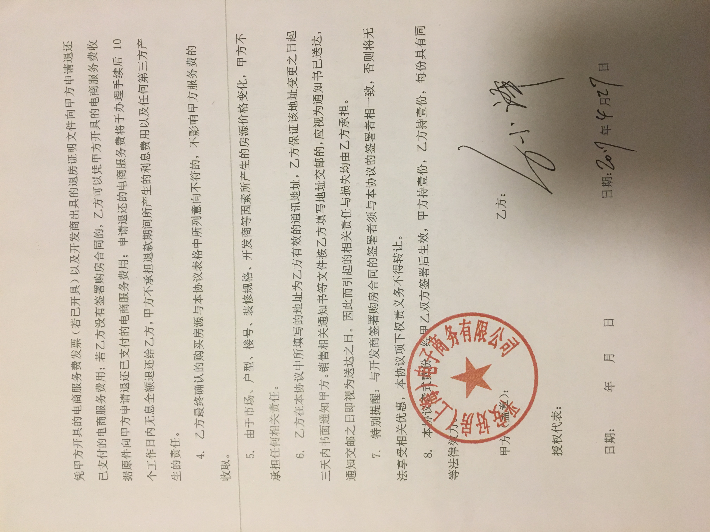

# 平安地产与平安好房违规收取电商费
## 案件描述
1. 嘉兴购别墅洋房，由于开发商销售人员诱导，致使我们与第三方（平安好房）签署了一份电商协议（团购费），噱头是以7万抵15万的优惠给到业主。后因优惠政策购买合悦江南一街坊的住房，后首付款期间让我们分两次付款，一部分是团购费，一部分是首付款（本以为付款全部为首付款，后被告知要分开付款，一部分是首付款，另一部分是团购费，并且团购费只开了收据），后经有经验的购房者提醒，这是违规行为，后续向12345转12348（国家法律咨询热线）咨询开发商收取电商费属于违规行为，并且向嘉兴市建委求证房屋备案价后证实备案价与合同出售价格不符，而且并没有15万的优惠。
2. 本小区有一个业主群，群里有不少的平安内部人员也购买了此房，并没有交电商费，而且很肯定的语气说这就是给平安好房的中介费，见下图： 

3. 业主希望通过政府维权，并没有得到解决，嘉兴政府回复“平安好房收取费用与开发商没有关系”，后打电话向平安好房投诉，得到的回复是“我们与开发商签署了相关协议，让业主找开发商解决此问题”，双方相互推脱，并不解决此问题，由此借助网络平台及媒体的力量来帮助我们这些受害者解决问题

## 相关材料
### 房屋买卖合同：

