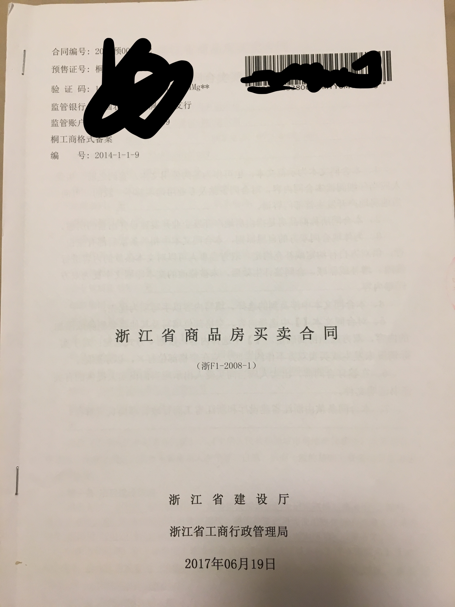
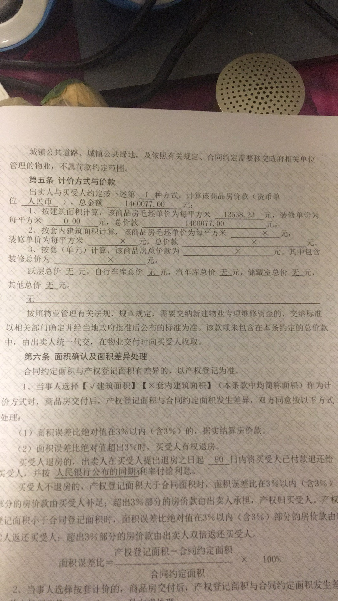

# 平安地产与平安好房违规收取电商费
## 事件经过
去年5月份在浙江桐乡买了一套房子，开发商是中国平安地产，当时中国平安地产销售人员以7万抵15万的优惠让我们买了这套房子，总价是151万（包括7万），后来支付首付的时候这7万元只开了收据，并且收据上写的是电商费，而且是付给了平安好房，购房合同里也没有提及这7万元抵15万元，后来加了业主群发现大多数业主都缴纳了这7万元的电商费，但电商费是国家明令禁止收取的，目前有50多位业主已经投诉上去了。

## 相关材料
### 房屋买卖合同：

